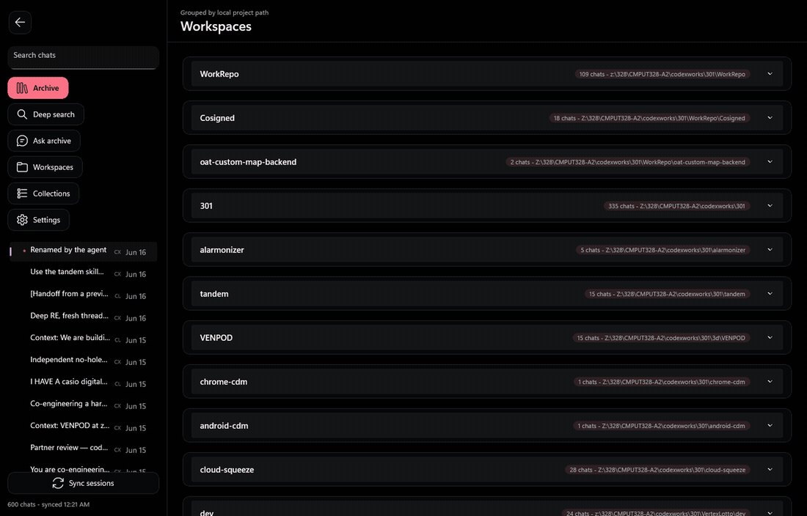
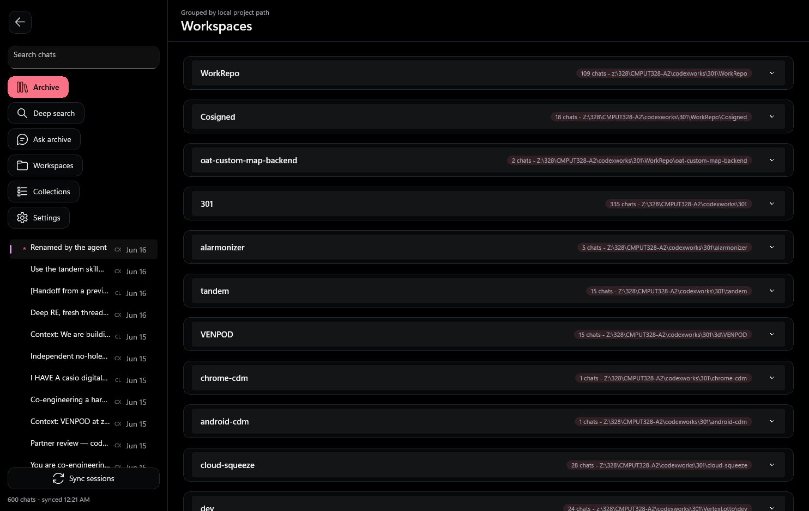
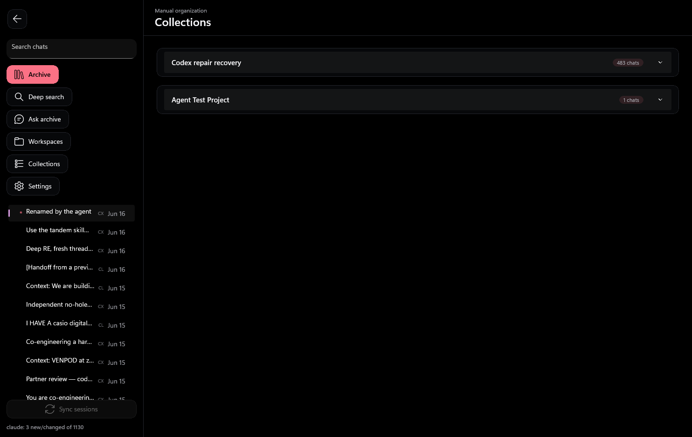
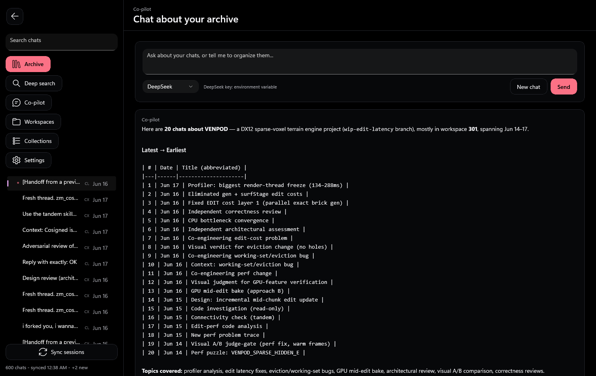
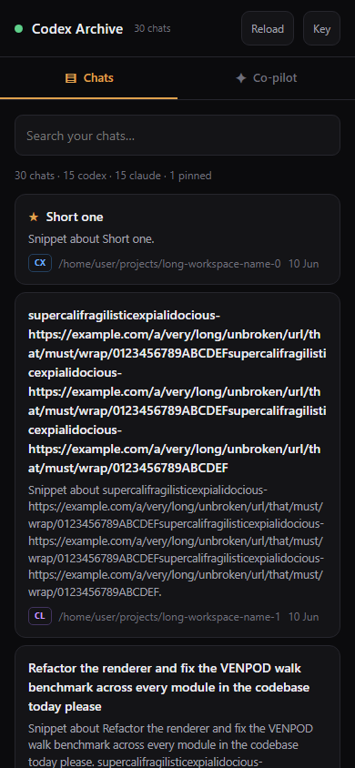

# MUX — your Codex & Claude chat archive

**MUX is a WinUI 3 / .NET 8 Windows desktop app that indexes your local Codex and Claude sessions
into one archive — so a months-old chat resurfaces, reads cleanly, files into a project, and
relaunches its `codex resume` / `claude --resume` command in a terminal.** A built-in DeepSeek
**co-pilot** can search, organize, and resume your chats by tool-calling over the archive; a Claude
or Codex session can even file itself in through a local JSON inbox. MUX never edits your source
transcript files.



*Real app screens: browse chats grouped by project, read a Claude chat with the noise stripped,
inspect the raw event timeline, organize into projects, and open the theme picker.*

| Chats grouped by project (Codex + Claude badges) | A project an agent filed itself into |
|---|---|
|  |  |



*The DeepSeek co-pilot answering "find chats about VENPOD" — it called `search_chats` over the
real archive and grouped the results itself.*

## Why it's hard

Agent CLIs scatter their history across machine-specific stores in two different formats: Codex
writes `rollout-*.jsonl` files under `~/.codex/sessions`, while Claude Code writes one transcript
per session under `~/.claude/projects/<encoded-cwd>/<id>.jsonl` — plus a *fan-out of sidechain
subagent transcripts* that share a parent id. Indexing both means streaming JSONL that is often
half-written (the live session you most want to resume), auto-detecting which format a file is,
keying Claude chats on the filename (their resumable id) while skipping the subagent noise, and
doing it incrementally so a relaunch re-reads a handful of changed files instead of fifteen hundred.
Every chat then carries app-owned organization (pins, projects, renames) that a re-sync must
preserve, not clobber — all off the UI thread so the window never stalls on a large scan.

## What you can do

- **Resurface old chats.** The app re-scans your live session stores on launch, so a conversation
  from months ago is back in the list — not lost after a month.
- **Read them cleanly.** The reader strips the IDE/environment/system-reminder boilerplate that
  buries the actual conversation (above).
- **Organize.** Chats auto-group by project path under *Workspaces*; file any chat into a named
  *Project*; pin favorites to the top. Organization survives every re-sync.
- **Resume in a terminal.** One action reopens a chat in a real terminal — `codex resume …` for a
  Codex chat, `claude --resume …` for a Claude chat — in its original working directory.
- **Inspect the raw timeline.** The Source inspector shows the real rollout events (messages, tool
  calls, commands, reasoning), not just a file path.
- **Ask a co-pilot.** A built-in chat (DeepSeek by default, set `DEEPSEEK_API_KEY` in your
  environment) tool-calls over the archive to find, summarize, get a stats overview, organize, open a
  chat in a floating window, or resume one in a terminal — with a confirmation step before any change
  or launch, and a Stop button to abort a long turn.
- **Let an agent set itself up.** Point any Claude/Codex chat at [`AGENTS.md`](AGENTS.md) and it can
  favorite itself, file itself into a project, rename itself, or register a chat folder in a
  non-default location — over a small JSON inbox.
- **Reach your archive from anywhere.** A small headless server
  ([`CodexLocalRetrieval.Server`](native/CodexLocalRetrieval.Server)) exposes the archive and the
  co-pilot over an authenticated web UI, so you can browse, read rollouts, chat, pin, and resume a
  chat in a terminal from your phone — proxied through your own VPS, with chats and keys staying on
  your machine. See [`REMOTE.md`](REMOTE.md).

## Run it

```powershell
git clone https://github.com/asajid2-cell/local-retrieval.git
cd local-retrieval/app/native/CodexLocalRetrieval.Native
dotnet run -c Debug
```

On first launch the app indexes `~/.codex/sessions` and `~/.claude/projects`. Add another folder in
**Settings → Sources**.

---
*Everything below is engineering detail.*

## Feature highlights

- **Two agents, one archive.** Codex rollouts and Claude transcripts are parsed by format and tagged
  with a `CX`/`CL` source badge throughout the UI.
- **Resume routing.** Each chat resumes with the right CLI and flags, in its own workspace cwd.
- **Incremental sync.** A per-file stamp cache skips unchanged files; a parser-version guard forces a
  full, orphan-pruning re-parse only when the parser itself changes.
- **Organization that sticks.** Pins, renames, and project membership are app-owned metadata kept in
  a separate local store and preserved across re-sync; source `.jsonl` files are never modified.
- **Canonical rename.** A rename can optionally write back to Codex's own thread title, so it shows
  up in `codex resume` too.
- **Agent inbox.** A polled `agent-inbox.jsonl` applies a fixed set of ops (init / addSource /
  favorite / addToProject / rename) and acks each to an outbox; unsafe session ids are refused.
- **Co-pilot with tools.** An orchestrator runs an OpenAI-style tool loop (DeepSeek primary, a
  degraded Claude-CLI fallback) over a narrow, typed tool surface — read-only retrieval returns
  ids/snippets first to protect the context, mutations are two-phase confirmed, and the model can
  never pass file paths or raw commands. Guardrails: round/call caps, per-message side-effect quotas,
  and a trusted-exe check before any terminal launch.
- **Secrets never leave the machine.** Before any archive text is sent to the model, a redactor masks
  high-confidence credential shapes (API keys, cloud keys, bearer tokens, JWTs, PEM private keys,
  `key = value` secrets) — so a key pasted into an old chat isn't exfiltrated to the model API.
- **Resilient model calls.** Transient errors (429 / 5xx / timeouts) are retried with bounded
  exponential backoff that honors `Retry-After`; a Stop button cancels an in-flight turn promptly.
- **Remote access, data stays home.** A headless ASP.NET Core server reuses the Core engine to serve
  a bearer-authenticated, mobile-first web UI (browse / read rollouts / co-pilot / pin / resume). It
  binds localhost and is published through your own reverse proxy, so the archive and the model key
  never leave your machine; the co-pilot stays read-only over the wire and state changes are explicit
  taps.



## Architecture

```
~/.codex/sessions, ~/.claude/projects        (your real session files — read-only)
            |  scan (off-thread, incremental, format-routed)
            v
   ArchiveService  --->  app store (%LocalAppData%, pins/projects/renames)
            |                     ^
            | merge (UI thread, app-fields preserved, orphans pruned)
            v                     |
       WinUI 3 UI  <--- agent-inbox.jsonl (outside agents drive the app)
```

### Where to look in the code

| Area | Path |
|---|---|
| Indexing, parsing, sync, resume, agent ops | [`native/CodexLocalRetrieval.Core/Services/ArchiveService.cs`](native/CodexLocalRetrieval.Core/Services/ArchiveService.cs) |
| Session / settings / command models | [`native/CodexLocalRetrieval.Core/Models/ArchiveModels.cs`](native/CodexLocalRetrieval.Core/Models/ArchiveModels.cs) |
| App shell, navigation, rendering | [`native/CodexLocalRetrieval.Native/MainPage.xaml.cs`](native/CodexLocalRetrieval.Native/MainPage.xaml.cs) |
| Resume-in-terminal, projects, bump | [`native/CodexLocalRetrieval.Native/MainPage.Sessions.cs`](native/CodexLocalRetrieval.Native/MainPage.Sessions.cs) |
| Agent self-service bridge | [`native/CodexLocalRetrieval.Native/MainPage.Agent.cs`](native/CodexLocalRetrieval.Native/MainPage.Agent.cs) |
| Co-pilot: tool loop, tools, backends | [`native/CodexLocalRetrieval.Core/Chat/`](native/CodexLocalRetrieval.Core/Chat/) (ChatOrchestrator, ArchiveToolService, DeepSeekBackend, ClaudexBackend) |
| Co-pilot UI + confirm + floating preview | [`native/CodexLocalRetrieval.Native/MainPage.Copilot.cs`](native/CodexLocalRetrieval.Native/MainPage.Copilot.cs) |
| Remote API + bearer gate (transport-agnostic) | [`native/CodexLocalRetrieval.Core/Remote/`](native/CodexLocalRetrieval.Core/Remote/) (RemoteApi, RemoteAuth) |
| Remote server host + web UI | [`native/CodexLocalRetrieval.Server/`](native/CodexLocalRetrieval.Server/) · recipe in [`REMOTE.md`](REMOTE.md) |
| Agent protocol reference | [`AGENTS.md`](AGENTS.md) |
| Service tests | [`native/CodexLocalRetrieval.Native.Tests/ArchiveServiceTests.cs`](native/CodexLocalRetrieval.Native.Tests/ArchiveServiceTests.cs) |

## Build & test

Prerequisites: Windows 10/11 and the .NET 8 SDK.

```powershell
dotnet build CodexLocalRetrieval.sln -c Debug
dotnet test native/CodexLocalRetrieval.Native.Tests   # service tests: parsing, sync, resume, agent ops
```

A portable MUX Windows x64 release is produced by [`tools/release/package-win-x64.ps1`](tools/release/package-win-x64.ps1). The package is `mux-win-x64.zip` and its top-level launcher is `MUX.exe`; the runtime executable under `app/` retains its internal name `CodexLocalRetrieval.Native.exe`.

## Known limits

- **Windows only.** The UI is WinUI 3 / Windows App SDK; the indexing core is plain .NET but the app
  targets `net8.0-windows`.
- **Resume needs the CLI installed.** Resume launches the real `codex` / `claude` binary; if neither
  is found it falls back to the name on `PATH`.
- **The co-pilot needs a key (and a CLI for resume).** Set `DEEPSEEK_API_KEY` in your environment;
  the Claude-CLI fallback is text-only (no tools) and experimental. Resume/launch tools require the
  real `codex`/`claude` CLI at a trusted path, or they refuse.
- **Canonical rename is Codex-only.** Renames always apply in-app; the write-back to the agent's own
  store is implemented for Codex's thread DB — Claude has no external rename API, so a Claude rename
  stays app-only (surfaced in the result message).
- **The agent inbox is a trusted local channel.** Any process running as you can append commands; the
  app runs only the fixed ops above and never arbitrary commands. See the trust note in `AGENTS.md`.
- **Not code-signed.** The portable ZIP is unsigned, so Windows SmartScreen may warn. This project is
  unofficial and not affiliated with OpenAI or Anthropic.

## License

See [LICENSE](LICENSE).
